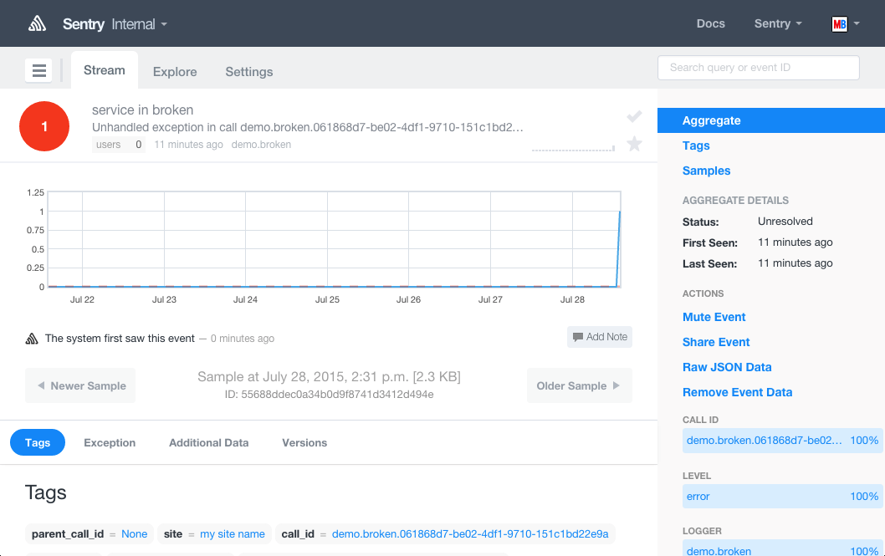

nameko-sentry
=============

Extension for `nameko <http://nameko.readthedocs.org>`_ that sends entrypoint exceptions to a `sentry <https://getsentry.com>`_ server.

Usage
-----

Add your sentry DSN and optional client configuration to your nameko config file:

.. code-block:: yaml

    # config.yaml
    SENTRY:
        DSN: ...
        CLIENT_CONFIG:
            site: "my site name"
            processors:
                - myapp.processors.SanitizePasswordsProcessor
    ...

Include the ``SentryReporter`` dependency in your service class:

.. code-block:: python

    # service.py
    from nameko.web.handlers import http
    from nameko_sentry import SentryReporter

    class Service(object):
        name = "demo"

        sentry = SentryReporter()

        @http("GET", "/broken")
        def broken(self, request):
            raise SomeException("boom")

Run your service, providing the config file:

.. code-block:: shell

    $ nameko run service --config config.yaml

Exceptions in entrypoints will be sent to your sentry server:

.. code-block:: shell

    $ curl -i http://localhost:8000/broken
    HTTP/1.1 500 INTERNAL SERVER ERROR
    Content-Type: text/plain; charset=utf-8
    Content-Length: 23
    Date: Tue, 28 Jul 2015 13:34:06 GMT

    Error: SomeException: boom

